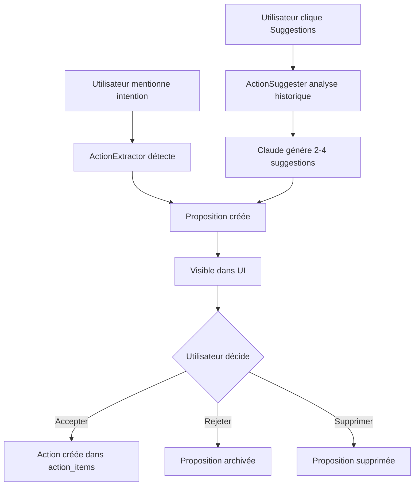

# Système d'Approbation des Actions par IA

## 🎯 Vue d'ensemble

Ce système permet à l'IA de **proposer des actions** pour améliorer le bien-être de l'utilisateur, que celui-ci peut ensuite **accepter ou rejeter**. Il améliore l'expérience utilisateur en donnant plus de contrôle sur les actions ajoutées à leur liste.

## ✨ Fonctionnalités principales

### 1. **Extraction automatique avec approbation**

Lorsque l'utilisateur mentionne une intention dans une conversation (ex: "Je vais méditer chaque matin"), l'IA:
- ✅ Détecte l'action potentielle
- ✅ La propose à l'utilisateur (au lieu de l'ajouter directement)
- ✅ L'utilisateur peut accepter ou rejeter la proposition

### 2. **Suggestions sur demande**

L'utilisateur peut cliquer sur un bouton "✨ Demander des suggestions à l'IA" qui:
- 📊 Analyse l'historique (check-ins, conversations, actions)
- 🤖 Génère 2-4 suggestions personnalisées
- 🎁 Les présente comme propositions à accepter/rejeter

### 3. **Interface de gestion**

Dans la page "Mes Actions", l'utilisateur voit:
- 📋 Liste des propositions en attente
- ✓ Bouton "Accepter" pour chaque proposition
- ✕ Bouton "Rejeter" pour refuser
- 🗑️ Option de suppression
- 📅 Possibilité d'ajouter une deadline lors de l'acceptation

## 🏗️ Architecture

### Base de données

Nouvelle table `proposed_actions`:
- **Stocke** les propositions en attente
- **Statuts**: `pending`, `accepted`, `rejected`
- **Lien** avec conversations et utilisateurs

### Modules créés/modifiés

#### Nouveaux fichiers:
- `src/llm/action_suggester.py` - Génère des suggestions personnalisées
- `migrate_proposed_actions.py` - Script de migration DB
- `test_proposed_actions.py` - Tests unitaires

#### Fichiers modifiés:
- `src/database/db_manager.py` - Méthodes pour gérer les propositions
- `src/database/schema.sql` - Nouvelle table `proposed_actions`
- `src/llm/action_extractor.py` - Crée des propositions au lieu d'actions
- `src/ui/action_items.py` - UI pour afficher et gérer les propositions
- `src/utils/prompts.py` - Nouveau prompt `ACTION_SUGGESTION_PROMPT`

## 🚀 Utilisation

### Pour l'utilisateur final

1. **Conversations naturelles**:
   ```
   "Je vais essayer de méditer 10 minutes chaque matin"
   → Proposition créée automatiquement
   → Visible dans "Mes Actions" avec boutons Accepter/Rejeter
   ```

2. **Demander des suggestions**:
   - Aller dans "Mes Actions"
   - Cliquer sur "✨ Demander des suggestions à l'IA"
   - L'IA analyse votre historique et propose 2-4 actions
   - Accepter ou rejeter chaque suggestion

3. **Gérer les propositions**:
   - **Accepter** ✓ → L'action est ajoutée à votre liste
   - **Rejeter** ✕ → La proposition est archivée
   - **Supprimer** 🗑️ → La proposition disparaît définitivement

### Pour les développeurs

#### Utiliser ActionSuggester

```python
from src.database.db_manager import DatabaseManager
from src.llm.action_suggester import ActionSuggester

db = DatabaseManager("serene.db")
suggester = ActionSuggester(db)

# Générer des suggestions
result = suggester.suggest_actions(user_id=1)

if result:
    print(f"{result['count']} propositions créées")
    print(result['message'])  # Message d'introduction
```

#### Gérer les propositions

```python
# Récupérer les propositions en attente
pending = db.get_proposed_actions(user_id=1, status="pending")

# Accepter une proposition
action_id = db.accept_proposed_action(
    proposal_id=5,
    deadline="2025-12-31"
)

# Rejeter une proposition
db.reject_proposed_action(proposal_id=6)

# Compter les propositions
count = db.get_proposed_actions_count(user_id=1)
```

## 📦 Installation

### Nouvelles installations

Aucune action nécessaire - la table `proposed_actions` est créée automatiquement via `schema.sql`.

### Bases de données existantes

Exécuter le script de migration:

```bash
python migrate_proposed_actions.py [chemin_db]
```

Par défaut utilise `serene.db`.

## 🧪 Tests

Exécuter les tests:

```bash
python test_proposed_actions.py
```

**Tests couverts:**
1. ✅ Création de proposition
2. ✅ Récupération par statut
3. ✅ Comptage des propositions
4. ✅ Acceptation → création d'action
5. ✅ Rejet de proposition
6. ✅ Prévention d'acceptation multiple
7. ✅ Suppression

## 💡 Avantages

### Pour l'utilisateur
- **Contrôle total** sur les actions ajoutées
- **Moins de bruit** - évite les actions non pertinentes
- **Personnalisation** basée sur l'historique réel
- **Flexibilité** - ajouter des deadlines lors de l'acceptation

### Pour le système
- **Qualité des données** - seulement actions validées
- **Engagement accru** - participation active
- **Feedback implicite** - rejets informent sur préférences
- **Évolutivité** - facile d'ajouter sources de suggestions

## 🔄 Workflow complet



## 📝 Notes techniques

### Méthodes DatabaseManager

```python
# Nouvelles méthodes ajoutées
save_proposed_action(user_id, title, description, conversation_id)
get_proposed_actions(user_id, status, limit)
accept_proposed_action(proposal_id, deadline)
reject_proposed_action(proposal_id)
get_proposed_actions_count(user_id, status)
delete_proposed_action(proposal_id)
```

### Prompts

**ACTION_SUGGESTION_PROMPT:**
- Analyse contexte utilisateur complet
- Génère suggestions personnalisées et actionnables
- Retourne JSON avec message + actions

**Modifications CONVERSATION_SYSTEM_PROMPT:**
- Détection automatique des intentions
- Suggestion d'actions sur demande

## 🎨 Interface utilisateur

### Section "Propositions en attente"

Affichée uniquement s'il y a des propositions:
- En-tête avec nombre de propositions
- Cartes visuelles pour chaque proposition
- Badge "✨ Proposé par l'IA"
- Boutons d'action clairs

### Section "Demander des suggestions"

Avant le formulaire de création manuelle:
- Titre "💡 Besoin d'inspiration ?"
- Explication courte
- Bouton avec spinner pendant génération
- Feedback de succès/erreur

## 🔮 Évolutions futures possibles

1. **Analytics des rejets** - Améliorer suggestions basé sur patterns
2. **Catégorisation** - Regrouper par thème (physique, social...)
3. **Notifications** - Alerter de nouvelles propositions
4. **Planification** - Suggérer meilleur moment pour chaque action
5. **Batch acceptance** - Accepter plusieurs d'un coup
6. **Notes sur rejets** - Comprendre pourquoi refusées

## 📊 Schéma de base de données

```sql
proposed_actions (
    id: PRIMARY KEY
    user_id: FOREIGN KEY → users
    title: TEXT
    description: TEXT
    status: 'pending' | 'accepted' | 'rejected'
    conversation_id: FOREIGN KEY → conversations
    proposed_at: TIMESTAMP
    reviewed_at: TIMESTAMP
)

Indexes:
- user_id
- status
- proposed_at DESC
```

## 🤝 Support

Pour questions ou problèmes:
1. Vérifier les logs de l'application
2. Exécuter `python test_proposed_actions.py`
3. Consulter ce README
